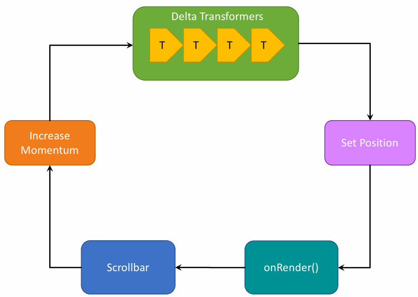

# Plugin System

> This is the API documentation for `smooth-scrollbar@8.x`, check [here](https://github.com/idiotWu/smooth-scrollbar/tree/7.x) for the docs of version 7.x.

> Looking for migration guides? See [migration guide](migration.md) for details.

The most exciting feature in v8 is the plugin system💥. The following section explains the lifecycle of a scrollbar the mechanism inside plugins.

## Table of Contents
- [The Scrollbar Lifecycle](#the-scrollbar-lifecycle)
- [Plugin System](#plugin-system)
  - [onInit()](#oninit)
  - [onUpdate()](#onupdate)
  - [transformDelta()](#transformdelta)
  - [onRender()](#onrender)
  - [onDestroy()](#ondestroy)
- [Plugin Options](#plugin-options)
  - [Update Plugin Options](#update-plugin-options)
- [Disable Specific Plugins](#disable-specific-plugins)
- [Plugin Order](#plugin-order)
- [Example: invert delta](#example-invert-delta)

## The Scrollbar Lifecycle

The following animation demonstrates the lifecycle of a scrollbar instance:



1. a DOM event called, and
2. the event wants to change the momentum of scrollbar,
2. delta values are sent to `transformDelta` hooks,
3. transformed delta values are applied to scrollbar, and caused scrolling position to change,
4. new position rendered, sends the remain momentum to `onRender` hooks.


## Plugin System

Typings overview:

```ts
type Data2d = {
  x: number,
  y: number,
}

abstract class ScrollbarPlugin {
  static pluginName: string;
  static defaultOptions: object;

  readonly scrollbar: Scrollbar;
  readonly options: any;

  onInit(): void;

  onUpdate(): void;

  transformDelta(delta: Data2d, fromEvent: any): Data2d;

  onRender(remainMomentum: Data2d): void;

  onDestroy(): void;
}
```

`ScrollbarPlugin` is an abstract class so you can't use it directly with `Scrollbar`. Normally you would subclass it with at least a `pluginName` property:

```js
import { ScrollbarPlugin } from 'smooth-scrollbar';

class MyPlugin extends ScrollbarPlugin {
  static pluginName = 'myPlugin';
}
```

`pluginName` property will be used to obtain plugin options later.

Each plugin has several hooks that bring you into the scrollbar lifecycle.

### onInit()

```ts
class MyPlugin extends ScrollbarPlugin {
  static pluginName = 'myPlugin';

  onInit() {
    console.log('hello world!');

    this._mount();
  }
}
```

`onInit()` is invoked right **after** a scrollbar instance is constructed. You can do some initialization here.

### onUpdate()

```ts
class MyPlugin extends ScrollbarPlugin {
  static pluginName = 'myPlugin';

  onUpdate() {
    console.log('scrollbar updated');

    this._update();
  }
}
```

`onUpdate()` is invoked **after** scrollbar is updated (ie `scrollbar.update()` method called). It may be a good time to update your plugin itself :).

### transformDelta()

```ts
type Delta = {
  x: number,
  y: number,
};

class MyPlugin extends ScrollbarPlugin {
  static pluginName = 'myPlugin';

  transformDelta(delta: Delta, fromEvent: Event): Delta {
    return {
      x: delta.x * 2,
      y: delta.y * 2,
    };
  }
}
```

`transformDelta()` is the most powerful method in plugin system. Let's say every scrolling is caused by a DOM event. Whenever an event called, it will update the momentum of scrollbar by a `Delta`.

So this hook will be invoked **immediately after DOM event occurs, and before the final `Delta` is applied to scrollbar**. `transformDelta()` offers a possibility to break the default mechanism so you can almost do any thing from simple delta scaling to overscroll effect! And all you need is to analyze the delta value then return a new delta to the lifecycle.

### onRender()

```ts
type Momentum = {
  x: number,
  y: number,
};

class MyPlugin extends ScrollbarPlugin {
  static pluginName = 'myPlugin';

  onRender(remainMomentum: Momentum) {
    this._remain = {
      ...remainMomentum,
    };

    this.scrollbar.setMomentum(0, 0);
    this._render();
  }
}
```

`onRender()` hook is invoked everytime render loop runs. You will be informed of the remain momentum of the scrollbar. Through the `scrollbar.addMomentum()` and `scrollbar.setMomentum()` method, this is the last chance to modify the momentum in a lifecycle.

Scrollbar is render in a `requestAnimationFrame` loop, so **DO NOT** perform any heavy operation in this hook, otherwise you might block the whole UI of your poor browser.

### onDestroy()

```ts
class MyPlugin extends ScrollbarPlugin {
  static pluginName = 'myPlugin';

  onDestroy() {
    console.log('goodbye');
    this._unmount();
  }
}
```

As the name shows, `onDestroy()` will be called **after** a scrollbar instance is destroyed, so you should do some cleaning jobs here.

## Plugin Options

Your lovely `pluginName` property is the only tunnel that connects your plugin and users. For example, suppose that we have a plugin named `meow`:

```ts
class MeowPlugin extends ScrollbarPlugin {
  static pluginName = 'meow';

  onInit() {
    console.log('meow', this.options);
  }
}
```

When someone wants to use the `MeowPlugin`, he or she needs:

```ts
import Scrollbar from 'smooth-scrollbar';
import MeowPlugin from 'meow-plugin';

Scrollbar.use(MeowPlugin);

Scrollbar.init(elem, {
  plugins: {
    meow: {
      age: '10m',
    },
  },
});

// > 'meow' { age: '10m' }
```

You can provide default options through `defaultOptions` property:

```ts
class MeowPlugin extends ScrollbarPlugin {
  static pluginName = 'meow';

  static defaultOptions = {
    age: '0d',
  };
}
```

### Update Plugin Options

Plugin options is a read-only object, so you should avoid the following operation:

```ts
// ❌ wrong
scrollbar.options.plugins = {
  overscroll: {
    effect: 'glow',
  },
};
```

Instead, you can update plugin options through `scrollbar.updatePluginOptions` API (available since `8.1.0`):

```ts
scrollbar.updatePluginOptions('overscroll', {
  effect: 'glow',
});
```

## Disable Specific Plugins

If you want to disable the plugin, simply set `plugin[pluginName]=false`:

```ts
Scrollbar.init(devil, {
  plugins: {
    meow: false,
  },
});

// MeowPlugin will NEVER be constructed on this scrollbar instance!
```

## Plugin Order

Scrollbar plugins are invoked from left to right (FIFO):

```ts
Scrollbar.use(PluginA, PluginB, PluginC);

// hooks executing order:
//  PluginA.transformDelta() -> PluginA.transformDelta() -> PluginC.transformDelta()
```

Let's say we have multiple plugins:

```ts
class ScaleDeltaPlugin extends ScrollbarPlugin {
  static pluginName = 'scaleDelta';

  transformDelta(delta, fromEvent) {
    return {
      x: delta.x * 2,
      y: delta.y * 2,
    }
  }
}

class NoopPlugin extends ScrollbarPlugin {
  static pluginName = 'noop';

  transformDelta(delta, fromEvent) {
    console.log(delta);
    return { ...delta };
  }
}

```

Now let's apply `delta = { x: 100, y: 100 }` to the scrollbar:

```ts
Scrollbar.use(ScaleDeltaPlugin, NoopPlugin);

// apply delta...

// > { x: 200, y: 200 }
```

Delta is first transformed by `ScaleDeltaPlugin` and then the `NoopPlugin`. What if we change the order?

```ts
Scrollbar.use(NoopPlugin, ScaleDeltaPlugin);

// apply delta...

// > { x: 100, y: 100 }
```

Ah, `NoopPlugin` is invoked first.

As the above section demonstrated, if you are using multiple plugins, be care of the loading order! Usually plugins like `OverscrollPlugin` that will change the layout are supposed to be the last man:

```ts
Scrollbar.use(PluginA, PluginB, PluginC, ..., OverscrollPlugin);
```

### Example: invert delta

This plugin allows you to invert delta for particular events.

```ts
import Scrollbar, { ScrollbarPlugin } from 'smooth-scrollbar';

class InvertDeltaPlugin extends ScrollbarPlugin {
  static pluginName = 'invertDelta';

  static defaultOptions = {
    events: [],
  };

  transformDelta(delta, fromEvent) {
    if (this.shouldInvertDelta(fromEvent)) {
      return {
        x: delta.y,
        y: delta.x,
      };
    }

    return delta;
  }

  shouldInvertDelta(fromEvent) {
    return this.options.events.some(rule => fromEvent.type.match(rule));
  }
}

Scrollbar.use(InvertDeltaPlugin);

const scrollbar = Scrollbar.init(elem, {
  plugins: {
    invertDelta: {
      events: [/wheel/],
    },
  },
});
```
